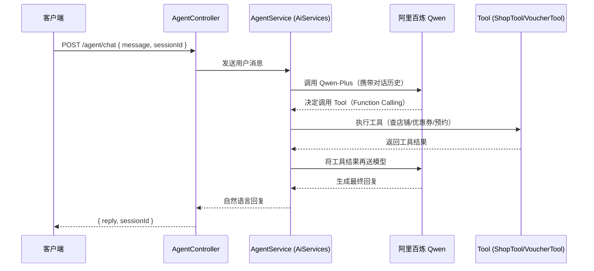

## 🚀LifePlus 智享生活平台         
### 技术栈
SpringBoot、Caffeine、Redis、MySQL、OpenResty、MyBatis、Lua、LangChain4j等

### 项目简介
实现了商家信息查询、秒杀优惠劵、消息主动推送、智能客服等多个模块
### 主要工作
1.秒杀防超卖：使用乐观锁防止高并发场景下超卖，分布式锁保证集群环境下一人一单。

2.秒杀流程优化：修改同步流程，用户下单后使用消息队列异步处理库存和生成订单，提高秒杀场景的并发性能，Lua脚本实现原子性下单资格校验。

3.缓存优化：通过逻辑过期解决缓存雪崩问题，采用缓存空值处理缓存穿透场景。

4.数据一致性：通过先更新数据库后删除缓存+消息队列补偿重试+TTL兜底，确保数据一致。

5.多级缓存：使用Redis结合Caffeine本地缓存、Nginx 本地缓存搭建三级缓存架构，提高数据访问速度、降低数据库压力，平均延迟由20ms降至10ms以内。

6.智能客服：接入阿里云百炼平台大模型，基于Function Calling实现查询信息和预约到店。
### AI Agent 架构

